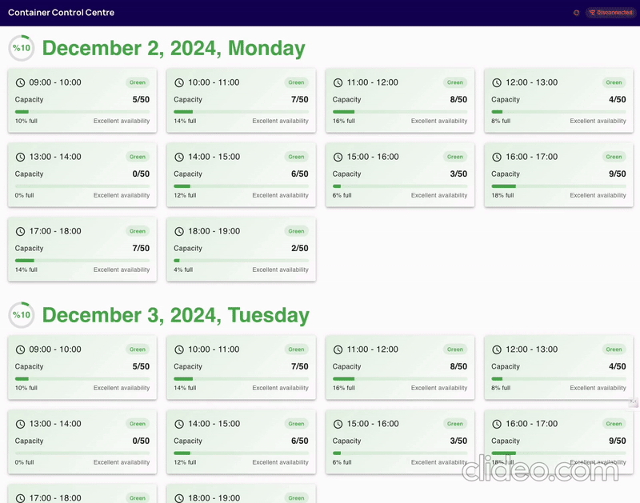
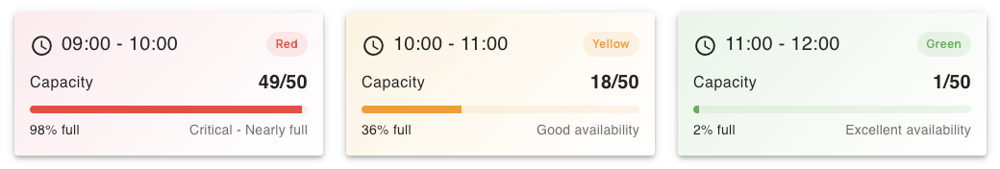
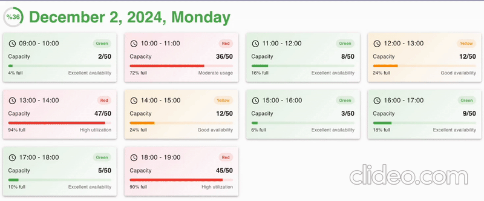
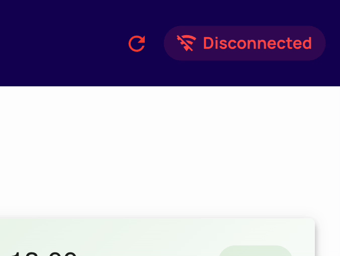
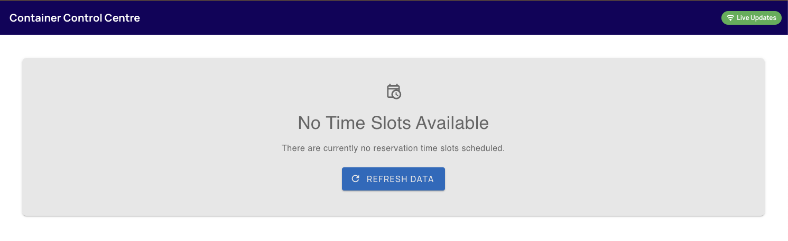
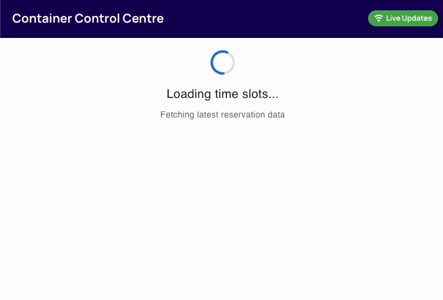
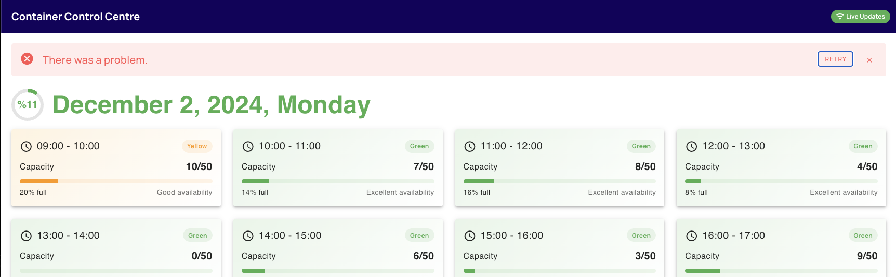
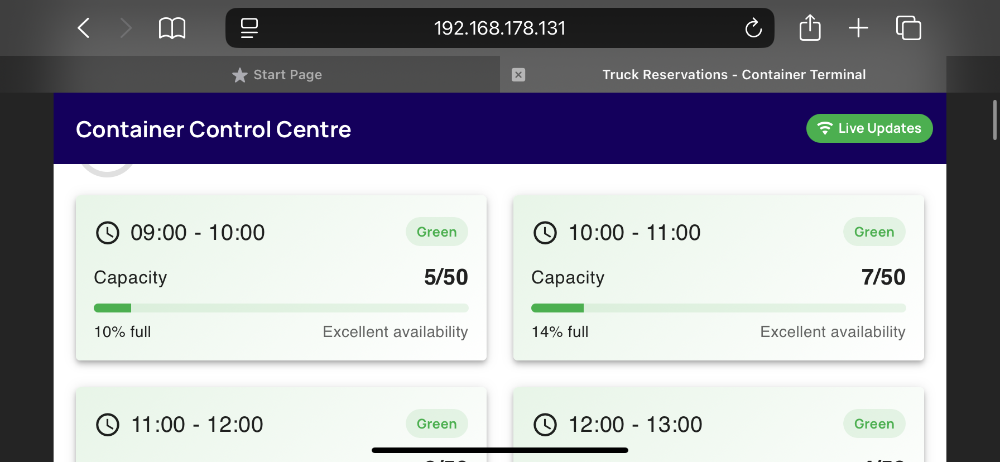
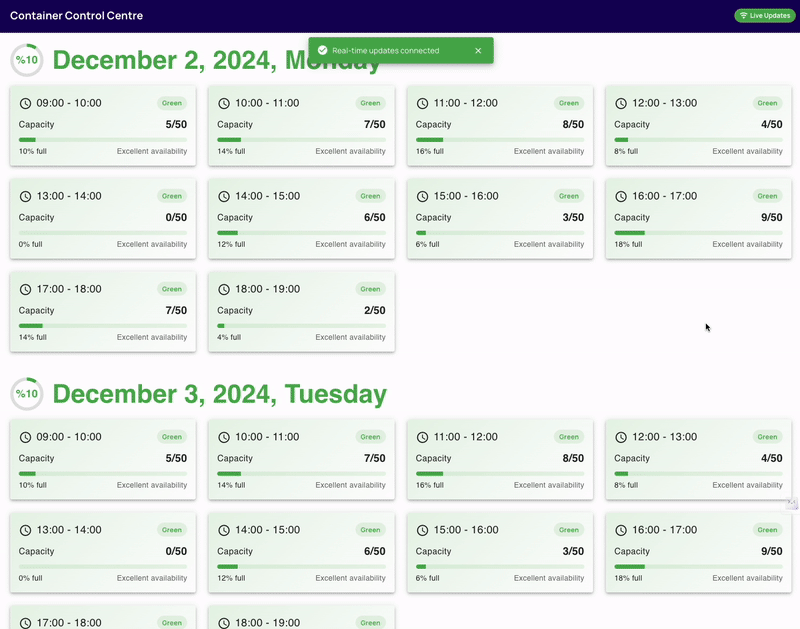

# 🚛 Truck Reservation Application

A modern, real-time web application focused on the management of reservation slots for truckers to pick up and deliver containers at terminals.


It displays and dynamically updates the capacity of time slots for these reservations on incoming events, built with Vue 3, TypeScript, Pinia and Vuetify.


- [Quick Start](#-quick-start)
  - [Prerequisites](#prerequisites)
  - [Installation](#installation)
- [Design Choices](#-design-choices)
  - [Card Component](#card-component)
  - [Overall Daily Capacity](#overall-daily-capacity)
  - [Live Updates Badge](#live-updates-badge)
  - [Edge Cases](#covering-edge-cases-no-data-loading-and-error)
  - [Responsive Design and Automatic SSE Reconnection](#-responsive-design-and-automatic-sse-reconnection)
  - [Colors and Typography](#-colors-and-typography)
- [Architecture Decisions](#️-architecture-decisions)
  - [Service Layer Pattern](#service-layer-pattern)
  - [Composable Pattern](#composable-pattern)
  - [Store Pattern](#store-pattern)
  - [Types](#types)
  - [Testing](#testing)
  - [Views and Components](#views-and-components)
  - [Styling and Animations](#styling-and-animations)
- [Development Workflow](#-development-workflow)
  - [Project Structure](#project-structure)
- [Production Build](#-production-build)
  - [Environment Configuration](#environment-configuration)

## 🚀 Quick Start

### Prerequisites

- **Node.js** 20+ (LTS recommended)
- **npm (Node Package Manager)**
- Modern web browser with SSE support (Chrome, Firefox, Safari)

### Installation

1. Clone the repository

```bash
git clone https://github.com/volcodes/container-control-centre.git
cd container-control-centre
```

2. **Install dependencies**

```bash
npm install
```

3. **Start the development server**

```bash
npm run dev
```

4. **Open your browser**

```
http://localhost:5173
```

If you run the project, application will automatically fetch data from the API (`https://timeslot-stream-ha2tva3niq-ey.a.run.app`) and start receiving real-time updates.



This is possible because the time slot store is using SSE to receive real-time updates that are then stored in the store and used to update the UI.

## 🎨 Design Choices

I implemented additional features that wasn't mentioned in the technical assignment that I thought would improve the user experience.

#### Card Component

Card component display colors in the background depending on the capacity of the time slot, while also displaying the category name of the time slot as a chip in the top right corner.



Also calculates and displays the capacity of each time slot as a number and a progress bar to display the current capacity of the time slot with informative texts.

```typescript
// src/components/Card.vue:72
if (current > max) {
  return `Over capacity by ${current - max} trucks`;
} else if (percentage >= 95) {
  return 'Critical - Nearly full';
} else if (percentage >= 85) {
  return 'High utilization';
} else if (percentage >= 70) {
  return 'Moderate usage';
} else if (percentage >= 40) {
  return 'Available capacity';
} else if (percentage >= 20) {
  return 'Good availability';
} else {
  return 'Excellent availability';
}
```

#### Overall Daily Capacity

Displaying the overall daily capacity for each day by calculating the total max capacity and current capacity, and displaying the percentage of the day. This allows users to quickly assess daily capacity at a glance while navigating different days.

```typescript
// src/components/SingleDayRow.vue:60
if (stats.value.totalCapacityPercentage >= 75) {
  return 'red';
} else if (stats.value.totalCapacityPercentage >= 40) {
  return 'orange';
} else {
  return 'green';
}
```



#### Live Updates Badge

Showing a badge in the header to indicate that the application is receiving live updates while the user is able to monitor the connection status and trigger a reconnect if needed. This empowers the user to take control of the connection and be able to recover from connection issues when needed.



Using emit for allowing header to trigger a reconnect if needed.

```typescript
// src/components/Header.vue
const emit = defineEmits<{
  (e: 'reconnect'): void;
}>();
```

#### Covering Edge Cases: No Data, Loading, and Error

I implemented no time slots available screen to cover edge cases.



Also implemented loading state and error state to cover edge cases.





#### 🎨 Responsive Design and Automatic SSE Reconnection

Utilized Vuetify's responsive grid system, and its utility classes to make the application mobile-first. I used Vuetify because it reduced the amount of code needed to make the application responsive.



Live capacity updates via SSE (`stores/timeslot.ts`) is avaiable on mobile devices as well. Also tables or phones can be viewed in vertical mode.


If the SSE connection is lost, the application will automatically try to reconnect.



#### 🎯 Colors and Typography

Mapped darkBlue from your brand colors to the application. Also used Manrope font for the application.

## 🏗️ Architecture Decisions

### **Service Layer Pattern**

Utilized the service layer pattern to isolate the API communication and data normalization. I tried to keep the store focused on state management and the components focused on UI.

```typescript
// src/services/timeslot.ts
class TimeSlotService {
  async fetchTimeSlots(): Promise<ServiceResponse<TimeSlot[]>>;
  private normalizeTimeSlot(raw: RawTimeSlotResponse): TimeSlot;
}
```

The service layer is responsible for fetching data from the API and normalizing it to the internal format. With this, the application can run smoothly regardless of the inconsistent field names (`max_capacity` vs `maximum`) || (`current_capacity` vs `current`) in API responses.

```typescript
/**
 * Normalize raw API response to consistent internal format
 * This handles the inconsistent keys from the API
 */
private normalizeTimeSlot(raw: RawTimeSlotResponse): TimeSlot {
  // ...
  const currentCapacity = raw.capacity.current_capacity ?? raw.capacity.current;
  const maxCapacity = raw.capacity.max_capacity ?? raw.capacity.maximum;
  // ...
}
```

### **Composables Pattern in Vue 3**

Used composable pattern to manage SSE connection, this logic can be extended to other use cases such as setting up a similar SSE connection with another API by making the existing SSE connection logic reusable.

```typescript
// src/composables/useSSE.ts
export function useSSE() {
  const connect = () => {
    /* SSE logic */
  };
  const disconnect = () => {
    /* SSE logic */
  };
  return { connect, disconnect };
}
```

Utilized `onBeforeUnmount` to clean up SSE connections and timers when the component is unmounted. This is a good practice to avoid memory leaks and improve the performance of the application.

```typescript
onBeforeUnmount(() => {
  sse.stopRealtime(); // Clean up SSE connections
});
```

### **Store Pattern**

Used Pinia to manage the state of the application. Also utilized single responsibility principle to keep the store small and focused on one responsibility.

```typescript
// src/stores/timeslot.ts
const store = useTimeslotStore();
store.handleSSEUpdate(data);
```

### **Types**

Used TypeScript to define the types of the application. Used conditional types to make the types more flexible and easier to read.

```typescript
// src/types/index.ts
export interface TimeSlot {
  id: number;
  startTime: string;
  endTime: string;
  category: SlotCategory;
  capacity: Capacity;
}
```

### **Testing**

I used Vitest to test the application but had no time to implement tests. But if I would have had more time, I would have implemented tests for the following:

- Service layer
- Notification component
- SSE connection and updates
- SingleDayRow component

### **Views and Components**

I used the following views and components:

- `Dashboard.vue` - Dashboard view container
- `SingleDayRow.vue` - Daily slot aggregation
- `Card.vue` - Individual time slot display
- `Header.vue` - Application header with connection status
- `LoadingIndicator.vue` - Loading state component
- `Notification.vue` - Toast notification component

### **Styling and Animations**

I used the Vuetify to style the application.

## 🔧 Development Workflow

### **Project Structure**

```
src/
├── components/          # Vue components
│   ├── Card.vue        # Individual time slot display
│   ├── Header.vue      # Application header with connection status
│   ├── LoadingIndicator.vue  # Loading state component
│   ├── Notification.vue      # Toast notification component
│   └── SingleDayRow.vue     # Daily slot aggregation
├── composables/         # Reusable reactive logic
│   ├── useSSE.ts       # SSE connection management
├── services/           # API communication layer
│   └── timeslot.ts     # Time slot service
├── stores/             # Pinia state management
│   └── timeslot.ts    # Time slot store
├── types/              # TypeScript definitions
│   └── index.ts        # Application types
├── assets/             # Static assets
├── App.vue             # Root component
├── main.ts             # Application entry point
└── style.css           # Global styles
```

### **Production Build**

```bash
# Build for production
npm run build

# The built files will be in the `dist/` directory
# Deploy the contents of `dist/` to your web server
```

### **Environment Configuration**

Currently uses hardcoded API endpoint.

Thank you for the consideration and the opportunity to work on this project. Don't hesitate to contact me if you have any questions.

[deveci2024@gmail.com](mailto:deveci2024@gmail.com)
